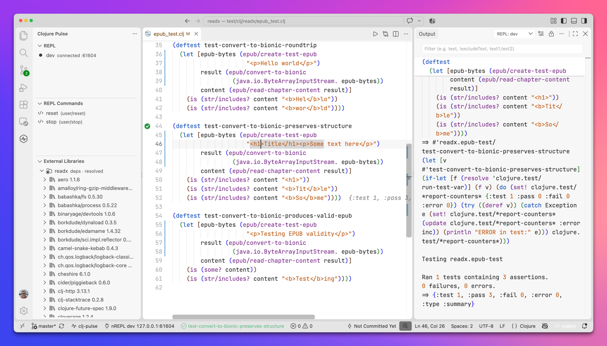
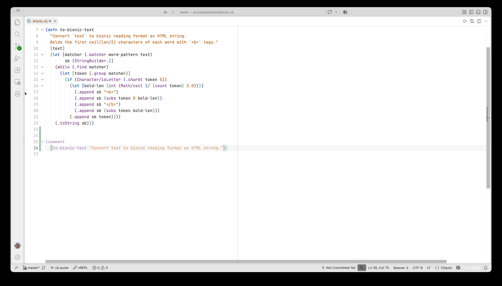
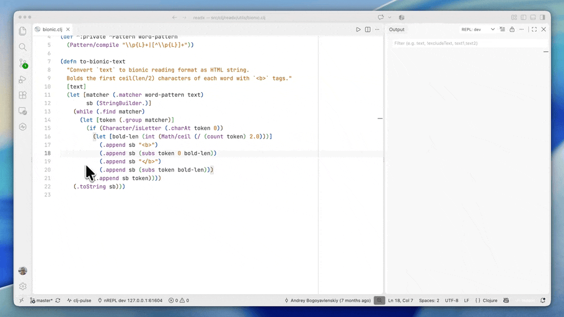
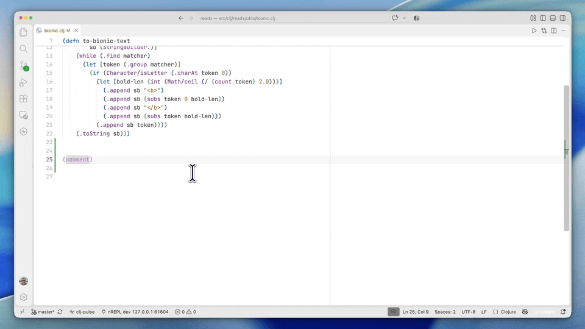
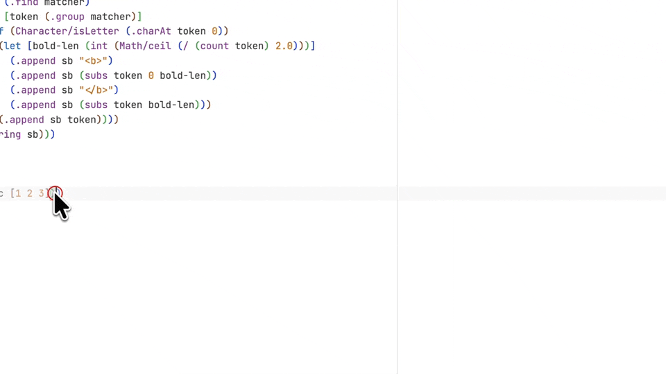
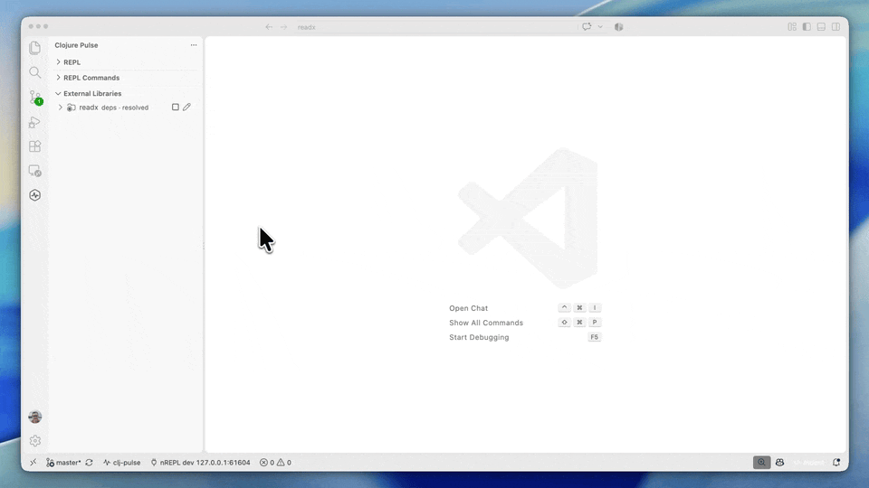

# Clojure Pulse


**Clojure editing, REPLs and tools in VS Code.**
Supports Clojure and [let-go](https://github.com/nooga/let-go), with language
intelligence from [clj-pulse](https://github.com/abogoyavlensky/clj-pulse).

Evaluate code and see results inline. Keep named REPLs in the sidebar and rerun tests from the file you are
editing. Move whole forms while preserving their layout.
Platform builds include the fast-starting clj-pulse language server.

[Get started](docs/getting-started.md) · [All features](docs/features.md) ·
[Documentation](docs/README.md) · [Keybindings](docs/keybindings.md)



## Keep your REPLs close

Use the **REPL manager** to name and configure your project's REPLs in a form.
Start a new process or connect to an existing server, run several at once, and
choose which one receives your evaluations. Each has its own output history.



Save everyday snippets such as `(user/reset)` and `(user/stop)` in **REPL
Commands**, then run them from the sidebar or your own shortcuts.



[REPL manager and custom commands →](docs/repl.md)

## Move a form. Its body follows.

Press **Tab** before a multiline form and its body moves with it, preserving
nested and hand-aligned code. **Enter** indents the next line; **paste** places
a multiline form at its new indentation while keeping its internal layout.

Use your project's **cljfmt** configuration or the **structural** indentation
engine. cljfmt ships with the extension and needs no separate installation.

For example, moving this map keeps its values aligned:

```clojure
{:name    "Ada"
 :role    :developer
 :active? true}
```



[Editing and formatting →](docs/editing.md)

## Evaluate where you work

Evaluate a form, selection, top-level definition, or file. Values appear beside
your code; hover for the full result or copy it. The highlighted brackets show
which form **Evaluate Current Form** will send, including inside rich comments:

```clojure
(comment
  (mapv inc [1 2 3])) ; evaluate (mapv ...) to get [2 3 4]
```



[Evaluation and inline results →](docs/repl.md#evaluating)

## Change code. Rerun the last test.

Run a test at the cursor or the tests in a namespace. See pass/fail marks in
the gutter, inspect failures on hover, and check the verdict in the status bar.

Switch to the implementation, make a change, and **Run Last Test Command**.
The test runs again while you stay in your file. With clj-reload available,
changed code is saved and reloaded before the run.

[Testing →](docs/testing.md)

## Explore your project and its dependencies

- **External Libraries:** browse dependencies and navigate within their source.
- **Monorepos:** discover subprojects, group their libraries, and control
  classpath resolution per project.
- **Language tools:** completion, definitions, references, rename, namespace
  fixes, and diagnostics, with optional clj-kondo linting.
- **Offline ClojureDocs:** open community examples in a focused editor hover
  with **Show ClojureDocs**.



[Navigation, libraries, and projects →](docs/projects.md)

## Your shortcuts, your choice

Evaluation, testing, and REPL commands leave shortcut selection to you. Start
with the [keybinding examples](docs/keybindings.md), including shortcuts for
named REPL commands and rerunning the last test. Enter and Escape have editor
bindings out of the box.

## Installation

Requires **VS Code 1.97+**. Download your platform's `.vsix` from
[GitHub Releases](https://github.com/abogoyavlensky/clojure-pulse-vscode/releases/latest),
then choose **Extensions → ⋯ → Install from VSIX…**.

Platform packages include clj-pulse starting with 0.6.0. Older releases and the
universal package need a separate server installation. To start a REPL, you
also need your project's runtime and build tool.

[Installation, remote hosts, and first evaluation →](docs/getting-started.md)

Under active development. [Report an issue](https://github.com/abogoyavlensky/clojure-pulse-vscode/issues)
or see [Troubleshooting](docs/troubleshooting.md).

## Inspiration and license

Inspired by [Cursive](https://cursive-ide.com/) and
[avli/clojureVSCode](https://github.com/avli/clojureVSCode).

[MIT](LICENSE). Copyright (c) 2026 Andrey Bogoyavlenskiy.
ClojureDocs examples are CC0; bundled Clojure docstrings are under the EPL.
See [ClojureDocs](docs/projects.md#clojuredocs) and
[Development](docs/development.md) for details and contributing instructions.
